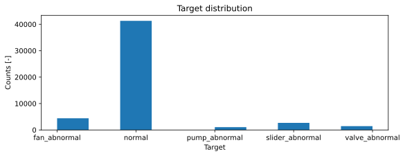

# Machinery Fault Detection via Sound Recordings

## Introduction

The purpose of the following is to classify the health status of four different machines using sounds recorded by microphones in real factory environments.
The [MIMII](https://arxiv.org/abs/1909.09347) dataset is used, which contains approximately 50,000 .wav files consisting of sound segments from normal and abnormal operations of the following machine types:

* 4 pumps
* 4 fans
* 4 slider rails
* 4  valves

All machines types are represented by various product models, adding an additional degree of complexity to the classification task.
The valves are solenoid valves that are repeatedly opened and closed. 
The pumps are water pumps that drain water from a pool and discharge it continuously. 
The fans represent industrial fans, which are used to provide a continuous flow of gas or air in factories.
The slide rails represent linear slide systems, which consist of a moving platform and a stage base.
All machine types have been subjected to various anomalies (not known), including contaminatoin, leakage, clogging, voltage changes, rotating imbalance, rail damages, loose belts, etc.

The sound recordings were collected using a circular microphone array that consists of 8 distinct microphones. This microphone array was kept at a distance of 50 cm away from the machines (or 10 cm in the case of valves), and recorded 16-bit, 8-channel, 10-second sound segments sampled at 16 kHz, mixed with backgroung noise (at various levels) from multiple real factories to simulate real operating environments. Using these measurements, a classifier will be built to detect if all machines operate under normal (healthy) conditions, or which machine type is operating under the presence of a fault.


## Load data


```python
import os
import numpy as np
import pandas as pd
import matplotlib.pyplot as plt
import utils
import features
import engine
import config
from sklearn.metrics import confusion_matrix, classification_report
```


```python
# Read data
df = utils.indexFiles(filePath = './data')

df.head(5)
```


<div>
<style scoped>
    .dataframe tbody tr th:only-of-type {
        vertical-align: middle;
    }

    .dataframe tbody tr th {
        vertical-align: top;
    }

    .dataframe thead th {
        text-align: right;
    }
</style>
<table border="1" class="dataframe">
  <thead>
    <tr style="text-align: right;">
      <th></th>
      <th>filepath</th>
      <th>machine_id</th>
      <th>machine_type</th>
      <th>background_noise</th>
      <th>target</th>
      <th>closest_mic</th>
    </tr>
  </thead>
  <tbody>
    <tr>
      <th>0</th>
      <td>\Desktop\MIMII - Sound datase...</td>
      <td>0</td>
      <td>fan</td>
      <td>-6_dB</td>
      <td>abnormal</td>
      <td>4</td>
    </tr>
    <tr>
      <th>1</th>
      <td>\Desktop\MIMII - Sound datase...</td>
      <td>0</td>
      <td>fan</td>
      <td>-6_dB</td>
      <td>abnormal</td>
      <td>4</td>
    </tr>
    <tr>
      <th>2</th>
      <td>\Desktop\MIMII - Sound datase...</td>
      <td>0</td>
      <td>fan</td>
      <td>-6_dB</td>
      <td>abnormal</td>
      <td>4</td>
    </tr>
    <tr>
      <th>3</th>
      <td>\Desktop\MIMII - Sound datase...</td>
      <td>0</td>
      <td>fan</td>
      <td>-6_dB</td>
      <td>abnormal</td>
      <td>4</td>
    </tr>
    <tr>
      <th>4</th>
      <td>\Desktop\MIMII - Sound datase...</td>
      <td>0</td>
      <td>fan</td>
      <td>-6_dB</td>
      <td>abnormal</td>
      <td>4</td>
    </tr>
  </tbody>
</table>
</div>


Let's plot a (part of) a randomly selected datapoint:


```python

backNoise  = '-6_dB'
machine_id = '0'
numSamples = 16000 # Number of time samples to plot (Entire sound recording is too large to be plotted)

for group, data in df.groupby(['machine_type']):

    normal   = data[(data['target'] == 'normal')   & (data['background_noise'] == backNoise)].sample()
    abnormal = data[(data['target'] == 'abnormal') & (data['background_noise'] == backNoise)].sample()

    normalFile   = normal.values[0][0]
    abnormalFile = abnormal.values[0][0]

    normalAudio   = utils.readWav(normalFile)
    abnormalAudio = utils.readWav(abnormalFile)

    fig, ax = plt.subplots(nrows = 2, ncols = 1, figsize = (12, 3.5), sharex=True, sharey=True)
    ax[0].plot(normalAudio[0:numSamples, :])
    ax[0].set_ylabel('Amplitude')
    ax[0].set_title('Target: Normal', loc = 'right')

    ax[1].plot(abnormalAudio[0:numSamples, :])
    ax[1].set_xlabel('Sample Index')
    ax[1].set_ylabel('Amplitude')
    ax[1].set_title('Target: Abnormal', loc = 'right')

    t = f'Partial audio waveform ( {group[0].title()} - Background noise: {backNoise} )'
    plt.suptitle(t, weight = 'bold');
    
    break
```


    

    


## Feature extraction

Each waveform consists of 160,000 points, which look like the plot above. These will be difficult to classify. Instead, the following set of features will be extracted from each of the eight waveforms:

* Time domain features
    1. Minimum value
    2. Maximum value
    3. Standard deviation
    4. Root Mean Squared value
    5. Power
    6. Skewness
    7. Kurtosis
    8. Peak value
    9. Shape factor
    10. Crest factor
    11. Clearance factor
    12. Peak-to-peak value  
* Instantaneous temporal features
    1. Zero-crossing rate
    2. Autocorrelation coefficients
* Spectral features
    1. Shape descriptors:
        * Spectral centroid
        * Spectral spread
        * Spectral skewness
        * Spectral kurtosis
    2. Spectrum slope
    3. Spectral decrease
    4. Roll-off frequency
    5. Spectral variation
    6. Spectral variation average
    7. Spectral variation variance
    8. Maximum amplitude
    9. Mel-frequency cepstral coefficients
    10. 1st derivative of MFCC
    11. 2nd derivative of MFCC
    12. Peak frequencies
    13. Peak relative amplitudes
    14. Amplitudes in 1/3 octave band
* Perceptual features
    1. Total loudness
    2. Relative specific loudness (Bark bands)
    3. Acoustic spread
    4. Acoustic sharpness
* Harmonic features
    1. Harmonic spectral deviation
    2. Inharmonicity
    3. Noisiness
    4. Odd-to-even energy ratio
    5. Tristimulus
    6. Fundamental frequency
* Other features (that do not fit in the above categories)
    1. Tonality coefficient

Apart from the full set of features extracted from each waveform, a subset of the spectral features is also extracted from the Bark spectrogram, and the instantaneous temporal features are extracted from their amplitude and energy envelopes. 
Subsequently, the weighted average of those features over time is evaluated, with the weights corresponding to the instantaneous loudness of the signal over time.

This amounts to 200 features per channel, for a total of 8 x 200 = 1600 features per record (sample).

From the extracted feature matrix, features containing more than 5% missing values will be dropped, whereas the remaining missing values will be convertedto zeroes. Finally, low-variance features (i.e. features whose standard deviation is lower than 5% of the feature exhibiting the maximum standard deviation) will be removed:


```python
numCores = 6
numFiles = df.shape[0]
pBar     = tqdm(desc = "Extracting features", total = numFiles)

# This will write a (new) .npy file for each datapoint
with features.tqdmJoblib(pBar) as progressBar:
    joblib.Parallel(n_jobs = numCores)(
        joblib.delayed(utils.featureExtractor)(fPath) for fPath in df['filepath'].values
    )
```

Extracting features: 100%|█████████████████████████████████████████████████████████████████████████████████████| 50895/50895 [4:26:34<00:00,  24.11it/s]


```python
# Index the files with the extracted features
df = utils.indexFiles(filePath = './data', extension = '.npy')

# Make predictors' matrix
X = np.stack([np.load(file) for file in df['filepath'].values], axis = 0)
X = X.reshape(X.shape[0], -1)  # Flatten: Num datapoints x (Num. features * Num. microphones)
X = pd.DataFrame(X)
X = utils.handleMissingValues(X)
X = utils.removeApproxConstant(X)
X = utils.removeCorrelated(X)
X = X.values

# Make target array
y = df['machine_type'].values + '_' + df['target'].values
y = np.array(['normal' if not('abnormal' in target) else target for target in y])

# Make groups for stratification
groups = df['machine_type'] + '_' + df['target']
```


```python
print(f'Predictor matrix shape: {X.shape}. Target matrix shape {y.shape}')
```

    Predictor matrix shape: (50894, 1231). Target matrix shape (50894,)
    

Let's have a look at the distribution of the targets:


```python
plt.figure(figsize = (9, 3))
plt.hist(y);
plt.title('Target distribution');
plt.ylabel('Counts [-]');
plt.xlabel('Target');
```


    

    


The majority of the samples correspond to normal (fault-free) operation. All faulty conditions are under-represented. We'll use different weights per class to counter the imbalance.

## Modelling

LightGBM is used with random hyperparameter search over k-fold cross-validation:


```python
# Train/test split
splitter = StratifiedShuffleSplit(
    n_splits     = 1,
    test_size    = config.TEST_SIZE, 
    random_state = config.SEED
    )

trainIdx, testIdx      = next(splitter.split(X, groups))
Xtrain, ytrain, gTrain = X[trainIdx, :], y[trainIdx], groups[trainIdx]
Xtest, ytest, gTest    = X[testIdx, :],  y[testIdx],  groups[testIdx]

# Run Cross validation with random hyperparameter search
bestParams, bestScore  = randomSearchCV(Xtrain.copy(), ytrain.copy(), gTrain)

# Convert targets to integers and the class weights
wDict    = classWeights(y)
cDict    = {k:i for i, (k, _) in enumerate(wDict.items())}
mapper   = lambda d, arr: np.vectorize(d.get)(arr)

wtrain, wtest  = mapper(wDict, ytrain), mapper(wDict, ytest)
ytrain, ytest  = mapper(cDict, ytrain), mapper(cDict, ytest)

# Fit with the best hyperparameters
model = lgb.train(bestParams,
    train_set = lgb.Dataset(Xtrain, label = ytrain, weight = wtrain),
    callbacks = [lgb.early_stopping(stopping_rounds = bestParams['early_stopping_rounds'])],
    num_boost_round = bestParams['num_boost_round']
    )

# Predict on the test set
yHat = model.predict(Xtest)
```


```python
print('========= Classification Report ==========')
print( classification_report(ytest, yHat.argmax(1), target_names = cDict.keys(), sample_weight = wtest / wtest.max() ) )

print('========= Confusion Matrix ==========')
print(confusion_matrix(ytest, yHat.argmax(1)))
```

    ========= Classification Report ==========
                     precision    recall  f1-score   support
    
       fan_abnormal       0.98      0.97      0.98 263.6903954802297
             normal       0.85      1.00      0.92 263.7563851163644
      pump_abnormal       1.00      0.87      0.93     264.0
    slider_abnormal       1.00      0.97      0.98 263.947565543074
     valve_abnormal       1.00      0.99      1.00 263.56645789840076
    
           accuracy                           0.96 1318.960804038069
          macro avg       0.97      0.96      0.96 1318.960804038069
       weighted avg       0.97      0.96      0.96 1318.960804038069
    
    ========= Confusion Matrix ==========
    [[ 1074    31     1     0     0]
     [   17 10297    11     0     2]
     [    5    29   230     0     0]
     [    0    20     0   648     0]
     [    0     3     0     0   356]]
    
